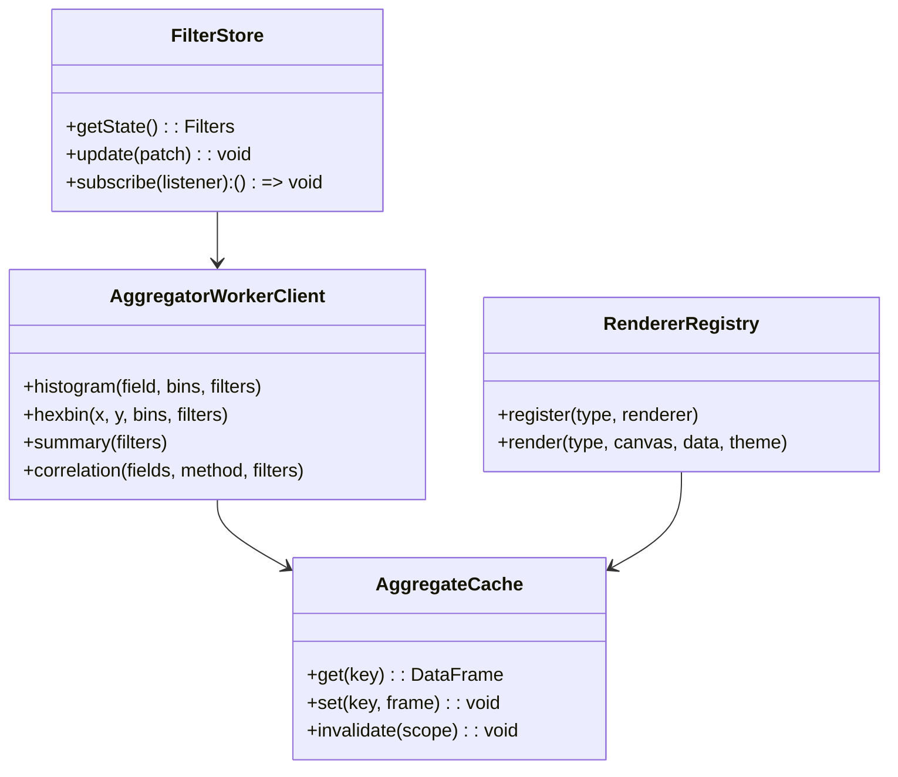

## Data Explorer → Plotting Engine & API: Architecture and Roadmap

### Vision
- **Goal**: Evolve the current 10M-row in-browser explorer into a reusable plotting engine with a clean API and fast, interactive charts that scale to large datasets.
- **Outcomes**: Stable visuals, rich interactions (A/B compare, snapshots), multi-dimensional plots (hexbin, correlation), and an API that other apps can call.

### Current state (summary)
- Solid 1D charts: histograms (time, width, height, strength), polar angle, categories.
- Robust brushing, filtering, and stats. Mini/Mega isolation works; chart lifecycle cleanup implemented.
- Stabilized y-scales and binning edge cases.

### Single-file commitment (no external files, no WebGL)
- Delivery: a single `.html` containing all code and styles.
- Workers: created inline via `Blob`/`URL.createObjectURL` (worker source assembled from template strings). No separate files.
- Rendering: Canvas2D only (no WebGL/GPU rendering). OffscreenCanvas may be used when available; fallback otherwise.
- Storage/transfer: use Transferable `TypedArray` buffers between main thread and Worker.
- Compression: prefer the built-in Compression Streams API for downloads; optionally include a tiny pure-JS codec inline if needed. WASM is allowed only if embedded as base64 in the same file (later phase).
- API façade: in-process JS service object that mirrors REST shapes; no network or server.

### Key enhancements (high impact)
- **New plots**:
  - Hexbin/heatmap: width × height, strength × time.
  - Correlation matrix: Pearson/Spearman across numeric fields; click-to-drill into hexbin/scatter.
  - Box/violin by category: compare distributions split by `category_4`/`category_2`.
  - CDF/Quantiles: percentile exploration per metric.
  - Polar heatmap: angle density with inner rings by strength.
  - Small multiples: replicate plots per category for side-by-side comparison.
- **Interactions**:
  - Compare mode: A/B pinning with lift, KS statistic, overlap area.
  - Snapshots: save/restore filter states; export comparison images.
  - Insight chips: auto-surface skew/peaks/bimodality with jump-to actions.
- **Performance**:
  - Pre-aggregated tiles for 1D/2D; selections slice counts instead of rescanning raw arrays.
  - Web Workers for filtering/aggregation; main thread only renders.
  - Optional WebGL render path for dense visuals.

---

### High-level architecture

```mermaid
flowchart TD
  subgraph UI[UI Layer]
    Controls[Controls/Brush]
    Charts[Renderers (Hist/Hexbin/Polar/Box)]
    Snapshots[Snapshots/Compare]
  end

  subgraph Engine[Engine Layer]
    Store[Filter Store + Event Bus]
    Cache[Aggregate Cache (1D/2D)]
  end

  subgraph Workers[Web Workers]
    Agg1[Aggregator: 1D hist]
    Agg2[Aggregator: 2D hexbin]
    Stats[Stats/Quantiles/Correlations]
  end

  subgraph OptionalServer[(Optional Server)]
    API[/REST API/]
    Warehouse[(Arrow/DuckDB)]
  end

  Controls -- update filters --> Store
  Store -- request aggregates --> Workers
  Workers -- aggregates --> Cache
  Cache -- data frames --> Charts
  Snapshots -- read/write --> Store
  Charts -- hover/brush events --> Store

  Store <-. sync via HTTP .-> API
  API --> Warehouse
```

---

### Selection lifecycle (sequence)

```mermaid
sequenceDiagram
  participant U as User
  participant C as Chart (Renderer)
  participant S as Store (Filters)
  participant W as Worker (Aggregator)
  participant Ca as Cache

  U->>C: Brush start/move/end
  C->>S: Emit candidate selection (preview)
  S->>W: Compute aggregates for preview (throttled)
  W-->>S: Aggregates (1D/2D)
  S->>Ca: Update cache entries
  C->>C: Re-render from cache (no raw scans)
  U->>C: Confirm selection
  C->>S: Commit filters
  S->>W: Recompute committed aggregates
  W-->>S: Aggregates
  S->>Ca: Update cache; version bump
  C->>C: Re-render stable view
```

---

### API design (v0) – local (single-file)

- **Filter model**
  - Numeric: `{ field, min, max }` (max exclusive)
  - Categorical: `{ field, include: number[] }`
  - Angular: `{ field, startDeg, endDeg }` (wrap-aware)
  - Envelope: `{ ranges: Range[], categories: CatFilter[], angle?: AngleRange }`

- **Local façade (no HTTP)**
  - `summary(filters)` → `{ count, percent, moments, quantiles, categoryShares }`
  - `histogram({ field, bins, range, filters })` → `{ binEdges, counts, filteredCounts, maxCount }`
  - `hexbin({ x, y, binsX, binsY, filters })` → `{ xEdges, yEdges, grid, maxCount }`
  - `correlation({ fields, method, filters })` → `{ matrix, fields, method }`
  - `percentiles({ field, probs, filters })` → `{ probs, values }`
  - `snapshots.create(state)` / `snapshots.get(id)`

All calls marshal to a single inline Web Worker that owns the raw columns and pre-aggregates, returning Transferables.

---

### Modules (engine)



---

### Performance plan (single-file, Canvas2D only)
- Pre-bin at multiple resolutions (e.g., 50, 100, 200 bins) to match canvas size.
- Maintain 2D hexbins for popular pairs; compute others on demand with caching.
- Move filtering and aggregation to a single inline Worker; main thread handles input/rendering only.
- Use fixed y-scales per dataset; tooltips use cached counts.
- No WebGL/GPU rendering. Optimize Canvas2D via pre-aggregates, transferables, and minimal overdraw.
- Use Compression Streams API for downloads (CSV/JSON/Arrow). Optional: embed a tiny JS codec if broader support is needed.

---

### Roadmap (single-file)
- **Phase 1: Engine extraction (1–2 days)**
  - Factor filter store, event bus, aggregate cache (in the same HTML as modules).
  - Formalize chart lifecycle with `init/draw/destroy` and reuse across plots.

- **Phase 2: Inline Worker + pre-aggregates (1–2 days)**
  - Create an inline Worker via Blob URL that owns columns and tiles (1D multi-res + 2D hexbin cache).
  - Wire façade calls to Worker messages; return Transferables.

- **Phase 3: New charts (2–3 days)**
  - Hexbin/heatmap, correlation matrix, box/violin; Canvas2D first.
  - Add A/B Compare and snapshots (stored in-memory; export as JSON string).

- **Phase 4: API façade polishing (1 day)**
  - Freeze JSON contracts for the local façade, add type guards and validation.
  - Implement Compression Streams for exports.

- **Phase 5: Optional enhancements (1–2 days)**
  - OffscreenCanvas path for Worker-side rasterization if supported; fallback to main thread.
  - Optional inline WASM (base64) for zstd if we need heavy compression (later).

---

### Risks & mitigations
- Large memory footprint for bins → use counts-first design; optionally store sparse indices for drilldowns only.
- Cross-thread serialization → Arrow tables or structured binary buffers for aggregates.
- Visual clutter with many plots → layout presets and small multiples per category.

---

### Open questions
- Which 2D pairs are most valuable to precompute? (width×height, time×strength as defaults?)
- Do we prefer browser-only (Workers) or a small Node/Express backend first?
- Priority order for Compare mode vs. new plot types?

---

### Next steps
- Confirm the first three charts to add: recommend Hexbin, Correlation Matrix, Box/Violin.
- I’ll scaffold the engine interfaces and Worker contracts, then wire one chart end-to-end.


